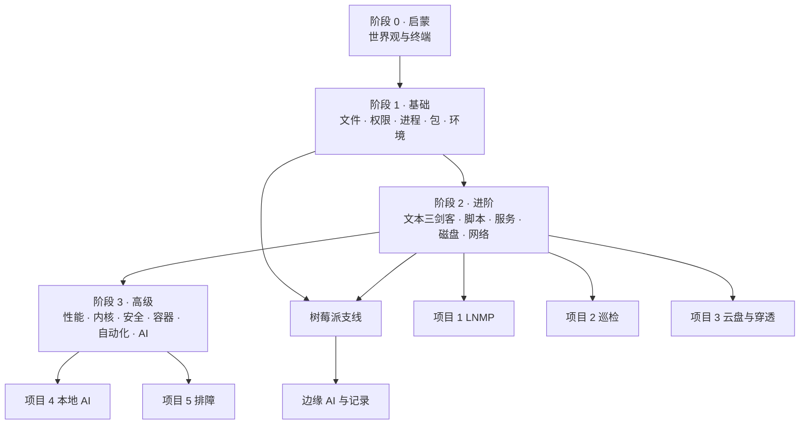

# 知识地图：把 42 章连成一张网

**知识不是孤岛。** 这一页回答三件事：某个知识从哪来（前置）、在这一章成为什么（产出）、后面还有谁在用它（后续）——迷路时先来这里定位。

> 使用方式：遇到陌生概念先查本表的「前置」列；学完一章后看「后续」列，知道它会在哪里派上用场。

## 一张总览图

## 关键知识的来龙去脉

| 知识 | 前置 | 本章产出 | 后续会用到 |
|---|---|---|---|
| **路径与文件操作** | 初见终端 | `ls/cd/cp/mv/rm`、绝对与相对路径 | 之后每一章；所有项目的第一次操作 |
| **权限与用户** | 文件操作 | rwx、特殊位、sudo 策略 | SSH 加固、共享目录、容器权限、`/tmp` 安全 |
| **进程与信号** | 文件操作 | ps/top、TERM/KILL、前后台 | systemd、性能观测、排障、容器 PID 1 |
| **管道与重定向** | 文件操作 | fd、`|`、`>`、tee、xargs | grep/sed/awk、日志分析、脚本与项目全流程 |
| **grep / sed / awk** | 管道 | 正则与文本处理三件套 | 日志排查、巡检脚本、数据清洗 |
| **环境变量与 PATH** | 文件操作 | 变量作用域、查找路径 | 脚本、服务运行环境、AI/GPU 工具链 |
| **Bash 脚本** | 管道 + PATH | 变量、条件、循环、函数、退出码 | 巡检脚本、备份、自动化运维 |
| **systemd 与日志** | 进程管理 | 单元、依赖、journalctl | 项目部署、定时任务、故障排查 |
| **磁盘与文件系统** | 文件操作 | 分区、挂载、inode、df/du | 家庭服务器、备份策略、容器卷 |
| **网络与远程** | 管道 | 地址/路由/DNS、SSH、传输 | 隧道与穿透、云盘、树莓派远程维护 |
| **Git 协作** | 文件操作 | 提交、分支、合并、PR | 教程贡献、代码审阅、团队协作 |
| **安全加固** | 权限 + 网络 | 最小暴露、SSH 硬化、防火墙 | 内网穿透、公开服务、家庭服务器 |
| **容器与虚拟化** | 权限 + 网络 + 磁盘 | 镜像、卷、cgroup 限额 | 本地 AI 部署、云盘、可复现环境 |
| **性能观测** | 进程 + 内存 | USE 方法、60 秒体检 | 排障案例、容量决策、调优 |
| **AI 辅助** | 全部基础 | 提示词、验证循环、幻觉防御 | 后续任何章的自学加速 |

## 三条并行的学习线

同一主题在教程里有七种形态，全部连着同一批章节：

| 形态 | 入口 | 适合什么时候 |
|---|---|---|
| 📖 正文 | 章节（本页各表） | 首次系统学习 |
| 🎬 动画 | [动画实验室](visual-lab.md) | 原理讲不清、想看「过程」时 |
| 📺 视频 | [视频课堂](videos.md) | 换一种讲解风格、听人讲 |
| ⚡ 速查 | [速查表](../cheatsheets/README.md) | 已经学过、只想快速回忆 |
| ✍️ 练习 | [练习册](../exercises/README.md) | 检验是否真的掌握 |
| 🚨 排错 | [错误信息索引](error-index.md) | 命令失败时 |
| ❌ 纠偏 | [常见误解 30 条](misconceptions.md) | 怀疑自己理解错了 |

**推荐循环**：读正文 → 看动画预测结果 → 跑实验验证 → 卡住查错误索引 → 复盘进笔记。同一知识点走完这一圈，比读三遍都牢。

## 三条典型路径

**路径 A：零基础 → 能干活**（最短主线）
阶段 0 全章 → 阶段 1 的 文件/权限/进程/包管理 → 管道 → Bash 脚本 → 项目 2 巡检。
产出：能在 Linux 上完成日常操作并写出可维护脚本。

**路径 B：奔服务器/云原生**
主线到 Bash 脚本 → systemd → 磁盘 → 网络 → 安全 → 容器 → 项目 1/3。
产出：能部署并维护带认证、备份与穿透的在线服务。

**路径 C：树莓派/硬件**
阶段 0-1 主线 → 网络与远程 → 树莓派支线 7 章 → 边缘 AI。
产出：一台可远程维护、能跑本地模型的小服务器。

三条路径可以叠加；每完成一条，回到 [学习路线](../LEARNING_PATHS.md) 勾掉对应成果。

## 迷路时的三步定位

1. **卡在命令**：查 [错误信息索引](error-index.md) → 找到主题 → 回对应章节的「命令实操」。
2. **卡在概念**：在本页搜关键词 → 看「前置」列 → 补前置章节，再回来看动画。
3. **卡在项目**：查项目章「方案设计」→ 缺哪块知识 → 沿「前置」列回溯补齐。

继续：[学习路线](../LEARNING_PATHS.md) · [工具导航](toolbox.md) · [动画实验室](visual-lab.md)
