# 动画实验室：先预测，再播放，最后动手

本库共 36 个原创 SVG 动画。[在线动画实验室](https://zhuguang-zfg.github.io/linux/#animations) 提供暂停、单步、速度调整、时间拖动和重播。GitHub 文档内仍可直接查看 SVG；生成的 30 个动画独立打开时每轮 12 秒、播放三轮后停止，支持“减少动态效果”设置，静态说明始终可读。

动画是原理示意，不是从真实机器采集的运行录像。验收仍要回到命令与实际输出。

## 管道中的数据变化

**先猜**：grep 不匹配时下游会收到什么？**动手**：把 [管道章节](../docs/02-advanced/01-管道与重定向.md) 的命令逐段运行，保存每一步输出。

## 文件系统如何挂到目录树

**先猜**：卸载后文件是丢失，还是路径看不到它？**动手**：用 [镜像文件挂载实验](../docs/02-advanced/07-磁盘与文件系统.md) 比较前后视图。

## 容器删除后，卷里的文件去哪了

**先猜**：镜像、容器可写层和命名卷哪一个保存数据？**动手**：按 [容器章节](../docs/03-pro/04-容器与虚拟化.md) 用不同容器读取同一命名卷。

## SSH 的两次身份检查

**先猜**：主机指纹和用户公钥是谁验证谁？**动手**：读 [网络章节](../docs/02-advanced/08-网络基础与远程连接.md) 的 ssh -v 输出，找出两个阶段。

## 备份为何最后才删旧文件

**先猜**：第六份归档失败时，五份旧备份应该怎样？**动手**：运行 [备份练习](../docs/02-advanced/05-Bash脚本编程.md)，比较预演、成功、失败三种结果。

## AI 建议如何变成可信笔记

**先猜**：模型给出一条命令，是否就能直接放进教程？**动手**：完成 [AI 辅助学习章节](../docs/03-pro/07-AI辅助学习与运维.md) 的手册核对与实测。

## 新增的二十四个状态演示

以下动画额外展示示意输入、命令或状态快照，配合学习站的单步控制观察变化：

| 动画 | 重点观察 |
|---|---|
| [apt 依赖](../assets/animations/apt-deps.svg) | 依赖解析、索引刷新与手动装包兜底 |
| [文件操作](../assets/animations/file-ops.svg) | 复制、改名、移动与不可逆删除 |
| [内网穿透](../assets/animations/intranet-tunnel.svg) | 私有网络组网与不暴露公网的访问 |
| [排障四段式](../assets/animations/triage-flow.svg) | 现象→原因→排查→解决的取证顺序 |
| [烧录系统](../assets/animations/flash-first-boot.svg) | 整卡覆盖风险与首次启动定位 |
| [归档与压缩](../assets/animations/archive-compress.svg) | 归档与压缩为何是两步 |
| [Vim 模式](../assets/animations/vim-modes.svg) | 普通/插入/命令模式与保存退出 |
| [选安装方式](../assets/animations/install-choices.svg) | 四种安装路线的磁盘边界与风险 |
| [边缘识别](../assets/animations/edge-inference.svg) | 采集、保存、识别、核对的分工 |
| [本地模型](../assets/animations/local-ai-request.svg) | 界面/命令行、兼容 API 与本地推理 |
| [PATH 查找](../assets/animations/path-lookup.svg) | 命令来源、查找顺序与子进程继承 |
| [grep 匹配](../assets/animations/grep-regex.svg) | 逐行匹配、输出选项与三种退出码 |
| [Git 分支](../assets/animations/git-branches.svg) | 分支指针、工作区切换和快进合并 |
| [stdout / stderr](../assets/animations/stdout-stderr.svg) | 重定向顺序如何改变描述符的目标 |
| [sed 替换](../assets/animations/sed-replace.svg) | 默认输出与原地修改的区别 |
| [awk 累加](../assets/animations/awk-aggregation.svg) | 每条记录如何改变统计结果 |
| [systemd 重启](../assets/animations/systemd-restart.svg) | 失败、等待策略和重新验证服务 |
| [cron 调度](../assets/animations/cron-schedule.svg) | 时间命中、执行环境和日志验收 |
| [进程信号](../assets/animations/process-signals.svg) | TERM 与 KILL 两种独立情况 |
| [内存缓存](../assets/animations/memory-cache.svg) | free、缓存与应用分配的关系 |
| [inode 与硬链接](../assets/animations/inode-links.svg) | 删除一个名字后，文件为何仍可读 |
| [DNS 查询](../assets/animations/dns-lookup.svg) | 解析成功后还需要连接与应用验证 |
| [LNMP 请求](../assets/animations/lnmp-request.svg) | Nginx、PHP-FPM 和数据库分工 |
| [GPIO 消抖](../assets/animations/gpio-debounce.svg) | 触点抖动、过滤窗口和最终记录 |

## 原有六个基础动画

| 动画 | 观察问题 | 继续学习 |
|---|---|---|
| [终端输入](../assets/animations/terminal-typing.svg) | 命令、参数和输出如何区分？ | [初见终端](../docs/00-onboarding/05-初见终端与Shell.md) |
| [网络包之旅](../assets/animations/packet-journey.svg) | 请求和响应经过哪些节点？ | [网络基础](../docs/02-advanced/08-网络基础与远程连接.md) |
| [进程生命周期](../assets/animations/process-lifecycle.svg) | 运行、等待和结束有什么区别？ | [进程管理](../docs/01-basics/06-进程管理.md) |
| [开机引导](../assets/animations/boot-sequence.svg) | 从上电到登录涉及哪些阶段？ | [内核与系统调用](../docs/03-pro/02-内核与系统调用.md) |
| [GPIO 点灯](../assets/animations/gpio-blink.svg) | 输出电平如何影响 LED？ | [GPIO](../docs/05-raspberry-pi/04-GPIO硬件编程.md) |
| [权限位](../assets/animations/permission-bits.svg) | 三组 rwx 分别属于谁？ | [用户与权限](../docs/01-basics/03-用户与权限.md) |

配合 [实物图鉴](hardware-gallery.md) 看真实设备，回到 [学习路线](../LEARNING_PATHS.md) 选择下一项成果。
